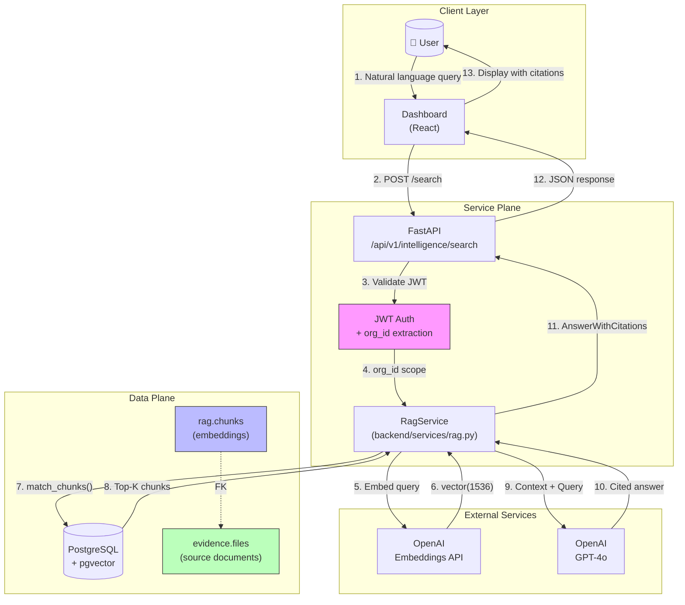

# RAG Safety Contract

> **Classification:** INTERNAL – COMPLIANCE ARTIFACT  
> **Version:** 1.0  
> **Effective Date:** 2026-01-01  
> **Owner:** Chief Information Security Officer (CISO)  
> **Review Cycle:** Quarterly

This document establishes the mandatory security controls, architectural boundaries, and operational rules governing the use of AI and Retrieval-Augmented Generation (RAG) within the Dragonfly Civil platform.

---

## Table of Contents

1. [Purpose & Scope](#purpose--scope)
2. [Core Principles](#core-principles)
3. [Architecture](#architecture)
4. [Security Controls](#security-controls)
5. [Data Handling](#data-handling)
6. [Audit & Compliance](#audit--compliance)
7. [Incident Response](#incident-response)
8. [Attestation](#attestation)

---

## Purpose & Scope

### Purpose

This contract defines the rules of engagement for all AI-powered features in Dragonfly Civil, ensuring:

- **Legal compliance** with data protection regulations (CCPA, state privacy laws)
- **Client trust** through transparent, auditable AI behavior
- **Risk mitigation** by preventing data leakage, hallucination, and unauthorized access

### Scope

This policy applies to:

| Component                   | Coverage                              |
| --------------------------- | ------------------------------------- |
| RAG Search API              | `/api/v1/intelligence/search`         |
| Document Embedding Pipeline | `rag.documents`, `rag.chunks`         |
| LLM Integrations            | OpenAI GPT-4o, text-embedding-3-small |
| Evidence Vault              | `evidence.files` linked to RAG chunks |

### Out of Scope

- Marketing/public-facing AI features (separate policy required)
- Internal developer tooling (IDE assistants, code generation)

---

## Core Principles

### Principle 1: No Direct LLM Access

```
┌─────────────────────────────────────────────────────────────────┐
│                      FORBIDDEN PATTERN                          │
│                                                                 │
│   Frontend ──────────────────────────────────► OpenAI API      │
│              ❌ NEVER ALLOWED ❌                                │
└─────────────────────────────────────────────────────────────────┘
```

**Rule:** The frontend (dashboard, mobile apps, client SDKs) **MUST NEVER** communicate directly with any LLM provider.

**Rationale:**

- Prevents API key exposure in client code
- Enables centralized audit logging
- Allows content filtering and rate limiting
- Ensures consistent prompt engineering

**Enforcement:**

- No LLM API keys in frontend bundles
- CSP headers block direct LLM API calls
- All AI traffic routes through `/api/v1/intelligence/*`

---

### Principle 2: Mandatory Attribution (Citations Enforced)

**Rule:** Every AI-generated statement **MUST** be linked to a source document in `rag.chunks`.

**Implementation:**

```python
class AnswerWithCitations:
    answer: str           # Contains inline [Doc: xxx, Page: y] markers
    citations: list[Citation]  # Structured links to evidence.files
    insufficient_evidence: bool  # True if context was inadequate
```

**System Prompt Enforcement:**

```
"For EVERY factual statement, append a citation [Doc: <id>, Page: <page>]."
"If the answer is not in the context, state 'Insufficient evidence'."
```

**Prohibited Responses:**

- Bare assertions without citations
- Claims sourced from LLM training data
- Speculative or inferred information

**Audit Trail:**

- Every RAG response logged with `chunks_retrieved` IDs
- Citation verification possible via `evidence.files.sha256_hash`

---

### Principle 3: Strict Data Isolation (Tenant Boundaries)

**Rule:** RAG retrieval is **strictly scoped** to the authenticated organization's data.

**Implementation:**

```sql
-- Row-Level Security on rag.chunks
CREATE POLICY "chunks_org_isolation" ON rag.chunks
    FOR ALL
    USING (org_id = (current_setting('request.jwt.claims')::jsonb ->> 'org_id')::uuid);
```

**API Enforcement:**

```python
# RPC call always includes org filter
result = await service.search(
    query=request.query,
    org_id=authenticated_org_id,  # Extracted from JWT, NEVER user-supplied
    ...
)
```

**Prohibited Patterns:**

- Cross-tenant data access
- Admin "super search" across all orgs (requires separate approval)
- Org ID passed from client request body

**Verification:**

- Quarterly RLS audit via `tools/security_audit.py`
- Penetration testing for tenant isolation

---

### Principle 4: Ephemeral Memory (No Model Training)

**Rule:** We **DO NOT** train, fine-tune, or improve LLM models using client data.

**Data Flow:**

```
Client Query → Embedding → Vector Search → Context Injection → LLM → Response
                                              ↑
                                   EPHEMERAL (not stored by LLM provider)
```

**Contractual Guarantees:**

- OpenAI API with data retention disabled (`"store": false`)
- No conversation history sent to LLM
- Each request is stateless and isolated

**What We Store:**
| Data | Location | Retention | Purpose |
|------|----------|-----------|---------|
| Document embeddings | `rag.chunks.embedding` | 7 years | Semantic search |
| Query logs | `audit.event_log` | 7 years | Compliance audit |
| LLM responses | NOT stored | N/A | Privacy by design |

**What We Never Store:**

- Raw LLM conversation history
- User queries in plain text (hashed for deduplication only)
- Model weights or fine-tuning data

---

## Architecture

### System Flow Diagram



### Component Responsibilities

| Component          | Security Role                            |
| ------------------ | ---------------------------------------- |
| **Dashboard**      | No AI logic; display only                |
| **FastAPI**        | Rate limiting, request validation        |
| **JWT Auth**       | Tenant identity, org_id extraction       |
| **RagService**     | Prompt engineering, citation enforcement |
| **pgvector**       | RLS enforcement, data isolation          |
| **evidence.files** | Immutable source of truth                |
| **OpenAI**         | Stateless inference only                 |

---

## Security Controls

### Authentication & Authorization

| Control            | Implementation                    |
| ------------------ | --------------------------------- |
| API Authentication | JWT (Supabase Auth) or API Key    |
| Org Scoping        | JWT claim `org_id` → RLS filter   |
| Rate Limiting      | 100 queries/min per org           |
| Request Validation | Pydantic models, max query length |

### Data Protection

| Control               | Implementation                            |
| --------------------- | ----------------------------------------- |
| Encryption at Rest    | Supabase managed (AES-256)                |
| Encryption in Transit | TLS 1.3 required                          |
| API Key Storage       | Environment variables only, never in code |
| Embedding Isolation   | Separate vector index per org (via RLS)   |

### LLM-Specific Controls

| Risk              | Mitigation                                            |
| ----------------- | ----------------------------------------------------- |
| Prompt Injection  | Context/query separation, structured prompts          |
| Data Exfiltration | No user-controlled system prompts                     |
| Hallucination     | Mandatory citations, "insufficient evidence" fallback |
| Token Limits      | Max 6000 context tokens, 2000 response tokens         |

---

## Data Handling

### Data Classification

| Data Type           | Classification | Handling                              |
| ------------------- | -------------- | ------------------------------------- |
| Evidence Documents  | CONFIDENTIAL   | Encrypted, RLS-protected              |
| Document Embeddings | INTERNAL       | RLS-protected, no PII in vector       |
| User Queries        | CONFIDENTIAL   | Logged (hashed), not sent to training |
| LLM Responses       | CONFIDENTIAL   | Returned to user, not persisted       |

### Retention Schedule

| Data              | Retention | Justification              |
| ----------------- | --------- | -------------------------- |
| `evidence.files`  | Permanent | Legal hold possible        |
| `rag.documents`   | 7 years   | Audit trail                |
| `rag.chunks`      | 7 years   | Matches document retention |
| `audit.event_log` | 7 years   | Compliance requirement     |

### Data Deletion

When an organization is offboarded:

1. `evidence.files` marked for deletion (respecting legal holds)
2. `rag.documents` CASCADE deleted
3. `rag.chunks` CASCADE deleted (embeddings destroyed)
4. Audit logs retained per retention schedule

---

## Audit & Compliance

### Logging Requirements

Every RAG query generates an audit entry:

```json
{
  "event_type": "rag_search",
  "org_id": "uuid",
  "user_id": "uuid",
  "query_hash": "sha256",
  "chunks_retrieved": 8,
  "model_used": "gpt-4o",
  "insufficient_evidence": false,
  "timestamp": "2026-01-01T12:00:00Z"
}
```

### Compliance Checks

| Check                        | Frequency | Tool                      |
| ---------------------------- | --------- | ------------------------- |
| RLS Policy Audit             | Weekly    | `tools/security_audit.py` |
| Cross-tenant Access Test     | Monthly   | Penetration test          |
| Citation Accuracy Spot Check | Quarterly | Manual review             |
| LLM Provider Compliance      | Annually  | Vendor assessment         |

### Certifications

| Standard      | Status      | Notes                 |
| ------------- | ----------- | --------------------- |
| SOC 2 Type II | In Progress | RAG included in scope |
| CCPA          | Compliant   | No sale of data       |
| GDPR          | N/A         | US-only operations    |

---

## Incident Response

### RAG-Specific Incidents

| Incident                       | Severity | Response                                |
| ------------------------------ | -------- | --------------------------------------- |
| Cross-tenant data exposure     | CRITICAL | Immediate service halt, breach protocol |
| Citation pointing to wrong org | HIGH     | Disable RAG, investigate RLS            |
| Hallucinated legal advice      | MEDIUM   | User notification, prompt review        |
| LLM API key exposure           | CRITICAL | Rotate keys, audit access               |

### Escalation Path

1. **L1 (Ops):** Rate limit exceeded, transient errors
2. **L2 (Engineering):** Citation failures, embedding errors
3. **L3 (CISO):** Data isolation breach, compliance violation

---

## Attestation

### Engineering Attestation

By deploying code that interfaces with the RAG system, engineers attest:

- [ ] No LLM API calls from frontend code
- [ ] All queries scoped by `org_id` from JWT
- [ ] Citations are verified against `rag.chunks`
- [ ] No user data sent to LLM training endpoints

### Quarterly Review Signoff

| Role             | Name               | Date         | Signature  |
| ---------------- | ------------------ | ------------ | ---------- |
| CISO             | ********\_******** | **\_\_\_\_** | ****\_**** |
| Engineering Lead | ********\_******** | **\_\_\_\_** | ****\_**** |
| Legal Counsel    | ********\_******** | **\_\_\_\_** | ****\_**** |

---

## Appendix: Quick Reference

### Prohibited Actions

❌ Frontend calling OpenAI directly  
❌ Passing `org_id` from request body  
❌ Returning answers without citations  
❌ Storing LLM conversation history  
❌ Fine-tuning models on client data  
❌ Cross-tenant vector search

### Required Actions

✅ Route all AI traffic through Service Plane  
✅ Extract `org_id` from authenticated JWT  
✅ Include `[Doc: xxx, Page: y]` in every claim  
✅ Return `insufficient_evidence: true` when context is inadequate  
✅ Log all RAG queries to `audit.event_log`  
✅ Verify RLS policies quarterly

---

_This document is a binding compliance artifact. Violations must be reported to the CISO within 24 hours._
